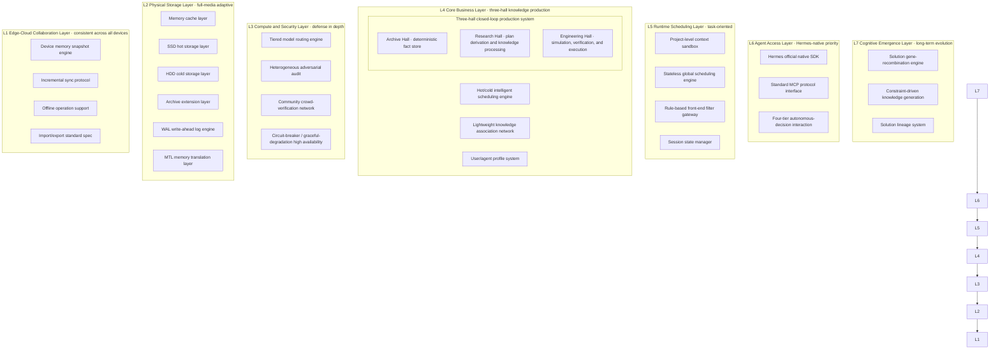
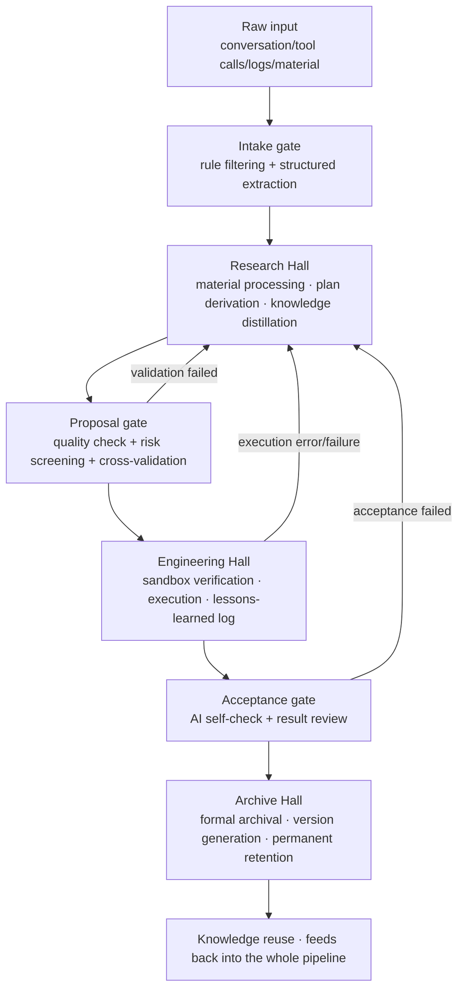

# Mnemosyne Memory Palace v5.0
## Cognitive Memory Operating System Product Whitepaper "Final Edition · Part 1"

**Version**: v5.2
**Release date**: June 2026
**Core positioning**: The world's first cognitive-grade independent memory operating system · natively co-designed with Hermes
**Core claim**: Memory is foundational infrastructure on par with the reasoning engine; builds a complete machine-cognition growth system spanning storage, governance, verification, adaptation, and emergence

---

## Version notes
Mnemosyne v5.0 is the formal capstone release of the entire architecture. After multiple rounds of deep refinement and expert co-design, the system completed its full evolution from "an elegant single-machine concept" to "production-grade distributed infrastructure" to "a cognitive memory operating system," forming six closed loops: architecture, security, ecosystem, cognition, interaction, and compliance. All design strictly follows five core philosophical principles — separation of powers and responsibilities, fidelity of raw data, hardware independence, ecosystem-driven growth, and restrained evolution — with self-consistent mechanisms, a clear path, and engineering feasibility. It is both a complete technical blueprint and an executable delivery program.

This version is the final edition aimed at engineering delivery, adding complete deployment configuration, hardware selection, and capacity planning content, covering every deployment scenario from a personal single machine to an enterprise cluster — usable directly for project delivery and technical review.

---

## Overview: Core design philosophy
All of Mnemosyne's design revolves around five foundational, non-negotiable principles — the soul of the system and the boundary that no feature evolution may cross:

1.  **Strict separation of powers and responsibilities**
    The memory system holds management rights; the reasoning engine only holds borrowing rights. This eliminates injection, tampering, and forgetting at the architectural root, making memory an independent, trustworthy single source of truth rather than an appendage cache of the large model.

2.  **Fidelity of raw data above all**
    Raw data is retained permanently, and derived data is fully traceable end to end. The evolution chain of knowledge is completely auditable; deletion only purifies content without breaking topological integrity — holding the line on the memory system's truthfulness.

3.  **Universal hardware independence**
    Logic and physical storage are fully decoupled — the same business code runs seamlessly from a single HDD to a distributed all-flash cluster, with performance scaling elastically with hardware and no hard hardware dependency.

4.  **Endogenous ecosystem growth**
    Rather than piling up its own capabilities, the system internalizes the diversity of its user base and the richness of the model ecosystem as the driving force behind its own trustworthiness and cognitive capability. More users and broader scenarios make the system stronger, forming a positive flywheel.

5.  **Restrained, orderly evolution**
    Always holds to its position as a memory foundation, never overreaching to replace large-model reasoning. All capability upgrades are natural growth of the existing architecture, with no destructive refactors — guaranteeing the stability and backward compatibility of the system's long-term evolution.

---

## Chapter 1: Industry background and core pain points
### 1.1 The dual bottleneck of agent adoption
As AI agents move from demos to production, they run into a dual structural bottleneck of "absent memory capability" and "fragmented deployment environments":
- On the memory side: native context resets on restart, bolted-on RAG stalls in an open loop, and in-app memory creates data silos — agents can never form a long-term, trustworthy, accumulating body of knowledge
- On the deployment side: hardware ranges wildly from low-end HDD servers and personal devices to enterprise clusters; most memory solutions carry hard hardware dependencies, making them hard to deploy everywhere

### 1.2 Deep misconceptions in industry thinking
The industry currently treats memory as "an appendage of reasoning," leading to three insurmountable flaws:
1.  **Confused responsibilities**: making the reasoning unit moonlight as storage manager is neither professional nor safe, and is easy to inject or hallucinate against
2.  **Open-loop stagnation**: knowledge is only ever written and read, with no closed loop of refinement, elimination, and iteration — it gets messier the more it's used
3.  **Fragmented ecosystem**: memory is bound to a single app or model, so users can never accumulate a permanent knowledge asset of their own

### 1.3 The standard for next-generation memory systems
A production-grade agent memory system must meet six core requirements: permanence, autonomy, economy, consistency, security, and universality. Mnemosyne v5.0 was built to satisfy every one of these standards, and goes further still — making the leap from "memory storage" to "cognitive growth."

---

## Chapter 2: Overall system architecture
Mnemosyne v5.0 uses a seven-layer, fully decoupled architecture. Each layer has a single responsibility and clear boundaries, can be upgraded or swapped independently, and the whole has strong extensibility and stability — forming a complete capability ladder from low-level hardware adaptation up to top-level cognitive emergence.



### Core role of each layer
1.  **L1 Edge-Cloud Collaboration Layer**: guarantees memory consistency across all devices, supports offline operation, incremental sync, standard import/export
2.  **L2 Physical Storage Layer**: a fully media-adaptive foundation; the MTL layer hides hardware differences, and WAL guarantees zero data loss
3.  **L3 Compute and Security Layer**: pluggable compute scheduling plus three-tier defense-in-depth security, balancing cost and trustworthiness
4.  **L4 Core Business Layer**: the soul of the system — the three-hall closed-loop knowledge production pipeline, driving knowledge accumulation and iteration
5.  **L5 Runtime Scheduling Layer**: the task-execution middle layer, isolating transient data from core assets to protect runtime efficiency
6.  **L6 Agent Access Layer**: Hermes-native first, while supporting the general ecosystem; tiered interaction balances reduced overhead with controllability
7.  **L7 Cognitive Emergence Layer**: a long-term capability — solution gene recombination and constraint-driven generation, enabling creative growth of knowledge

---

## Chapter 3: Core business system — the three-hall closed-loop knowledge production pipeline
The three halls are what sets Mnemosyne apart from every RAG plugin — an industrial-grade knowledge production pipeline that fully automates the flow from raw material to standardized knowledge assets.



### 3.1 Archive Hall: deterministic fact store
The system's single source of truth — nothing enters without full acceptance; once in, it's faithful, traceable, and versioned.
- **Five-tier memory distillation tree**: fragment memory → session memory → daily memory → systematized knowledge → meta-rule base, distilled tier by tier, with the underlying raw data retained permanently
- **Six collection partitions**: skill library, project archive library, factual knowledge library, agent profile library, lessons-learned library, raw material library
- **Full-lifecycle version management**: semantic version numbers, supporting version comparison, one-click rollback, and change tracing

### 3.2 Research Hall: knowledge derivation and plan design
The knowledge-processing workshop — every output here is an unverified intermediate product, never written directly to the main store.
- Multi-source material integration, structured knowledge distillation, plan generation and derivation, cross-validation mechanisms, profile-state checking

### 3.3 Engineering Hall: simulated verification and execution
The knowledge-verification proving ground — fully isolated, fully logged, nothing enters without verification.
- Project-level isolated sandboxes, full-chain logging of step-by-step execution, a feedback-and-iteration mechanism for problems, a standardized acceptance system

### 3.4 Three-gate verification mechanism
Three rigid gates guarantee knowledge quality: the intake gate filters invalid information, the proposal gate validates plan feasibility, and the archival gate verifies final outcomes.

---

## Chapter 4: Core technology engines
### 4.1 Cross-media adaptive storage engine
#### 4.1.1 MTL memory translation layer
Uses a two-level mapping of "Logical Memory Address (LMA) → Physical Memory Address (PMA)." Upper-layer business only ever interacts with the permanent, unchanging logical address, while underlying hardware changes stay completely transparent. A TLB-style lookup table is kept resident in memory, giving <0.1ms latency on frequent access.

#### 4.1.2 Full-scenario hardware adaptation
On startup the system automatically probes the storage media and matches the optimal tiering strategy, with no hard hardware dependency.
- **Standard hybrid mode (SSD+HDD)**: full four-tier hierarchy, the optimal balance of performance and cost
- **Pure-SSD high-performance mode**: all data on SSD, unified 2048-dim high-precision vectors, maximum performance
- **Pure-HDD low-barrier mode**: large memory cache as a backstop + ZVEC DiskANN disk index, 90% of queries are indistinguishable in feel from SSD
- **NAS/object-storage expansion mode**: the remote tier serves as archival storage, with metadata and indexes kept locally, giving unlimited capacity expansion

#### 4.1.3 Heat-scoring algorithm
$$
S_t = S_{t-1} \times \alpha^{\Delta t} + \sum_{i=1}^{n} w_i \times f_i
$$
Combines exponential decay with access weighting, recomputed daily, driving smooth migration between hot and cold data.

#### 4.1.4 Smooth migration on hardware change
Supports hot-add detection, background asynchronous migration, rate-limited throttling, and failure rollback — hardware changes are invisible to the business layer.

### 4.2 Intelligent compute scheduling engine
#### 4.2.1 Tiered model ladder
Built on the Doubao model matrix as a baseline, extensible to any vendor's models, forming a complete capability/cost ladder: foundational tool tier, lightweight compute tier, primary reasoning tier, vertical compute tier, generation tool tier.

#### 4.2.2 Automatic upgrade/downgrade algorithm
Lowest-cost-first with a confidence backstop: tasks default to the lowest-cost model and are automatically escalated when quality falls short — maximizing cost reduction while guaranteeing results.

#### 4.2.3 Two-tier semantic cache
Vector cache + distillation-result cache — identical content hits the cache directly, cutting redundant compute spend by over 60%.

### 4.3 Triple-recall retrieval engine
Combines vector semantic recall, full-text exact recall, and lightweight knowledge-association recall, balancing precision, breadth, and relevance.

#### Hybrid ranking weighting formula
$$
Score_{final} = w_1 \cdot Sim_{vector} + w_2 \cdot Q_{quality} + w_3 \cdot S_{hot} + w_4 \cdot T_{timeliness}
$$

#### Three-tier graduated return mechanism
L0 core tier (default, most token-efficient) → L1 summary tier (moderate complexity) → L2 full-text tier (deep retrieval), loaded on demand to balance effectiveness against token cost.

### 4.4 Persistence and failure-recovery system
#### WAL write-ahead log mechanism
Every write strictly follows "log first, then data," with fsync forcing data to disk; on power loss and restart, the log is automatically replayed to recover.

#### Failure-recovery SLA
- Confirmed-write data loss rate: 0
- Service recovery time (RTO): < 30 seconds
- Recovery point objective (RPO): < 1 second

#### Tiered failure degradation
Single-media, single-model, and single-module failures each have a corresponding degradation strategy — core archival and retrieval functions are never interrupted.

---

## Chapter 5: Advanced architecture and governance system
### 5.1 Clustering evolution path
Adopts a pragmatic two-step strategy of "shared storage first, then step toward distribution," balancing near-term delivery efficiency against long-term scaling headroom.
1.  **Stage 1: shared storage + centralized metadata**
    Stateless compute nodes + shared storage + highly-available primary/standby metadata, suited to hundreds of instances, 100% compatible with the single-machine edition
2.  **Stage 2: distributed sharding + Raft consensus**
    A Raft metadata cluster + sharded data storage, suited to tens of thousands of instances and beyond, eliminating single points of bottleneck
3.  **Stateless global scheduling**: all task state is persisted to the metadata cluster, enabling preemptive scheduling and resumable execution, with no single point of failure in the scheduling layer

### 5.2 Three-tier defense-in-depth security system
Defends against knowledge poisoning and contamination end to end — at the entry point, during processing, and over the long term.
1.  **First layer: adversarial intake filtering**: factual-consistency checks, anti-prompt-injection detection, manual review of suspicious content
2.  **Second layer: heterogeneous adversarial audit**: reverse-challenge generation → re-reasoning by a heterogeneous model → a parallel competition window → survival-of-the-fittest selection, avoiding bias from relying on a single model
3.  **Third layer: heat-bias correction and silent audit**: a heat-correction formula prevents runaway weighting of high-frequency errors; periodic random sampling of high-heat knowledge proactively roots out stale or incorrect entries

### 5.3 Community crowd-verification network
Builds a naturally heterogeneous verification cluster on top of the user ecosystem:
- Anonymously reports call results — only knowledge ID, execution result, and model tier are reported, with no private information involved
- Cross-validation across multiple models: the more thoroughly a piece of knowledge is exercised, the higher its confidence climbs
- The larger the user base and the more diverse the models, the more trustworthy the knowledge base becomes — forming a positive ecosystem flywheel

### 5.4 Full-chain observability and audit
#### Knowledge evolution DAG
A dual-granularity, layered lazy-loading design: the overview layer renders the main chain instantly, and the detail layer drills down on demand to a single audit log entry — presenting the full lifecycle of knowledge from raw material to systematized skill.

#### Explainable recall results
Every recall returns the per-dimension scores and source explanation alongside the results, making it quick to spot anomalies and lowering debugging cost.

### 5.5 Collective knowledge ecosystem governance
#### Multi-dimensional value evaluation model
$$
Value_{public} = w_1 \cdot F_{reuse} + w_2 \cdot I_{impact} + w_3 \cdot E_{expert} + w_4 \cdot T_{timeliness}
$$
Escapes the frequentist trap by evaluating knowledge value on a combination of reuse frequency, impact magnitude, expert endorsement, and timeliness.

#### Intelligent impact quantification
Automatically computes an impact factor from four weak-signal dimensions — emotional polarity, time-to-resolution, ripple effect, and failure severity — with no manual tagging required.

#### Knowledge extinction and fossilization mechanism
Knowledge that depends on an environment that no longer exists is marked "extinct" and moved into a knowledge-fossil store, permanently retained as a special lessons-learned record — avoiding misleading users while preserving the full evolution chain.

#### Contributor reputation system
A contributor's acceptance rate determines their future weighting — good currency drives out bad.

### 5.6 Balancing compliance and fidelity
#### Hash-purification mechanism
Compliance-driven deletion never physically removes data; instead, a SHA-256 hash one-way replaces the original content, making it unreadable while preserving metadata, relationships, and the evolution chain — satisfying the right to be forgotten without breaking the structural integrity of the knowledge system.

#### Fossil-node design
A purified node renders in the DAG as a grey "fossil" — its content can't be viewed, but its topological position and chain continuity are fully preserved, upholding the "raw fidelity" philosophy at the core of the system.

---

## Chapter 6: Native deep integration with the Hermes agent
### 6.1 Core value
Solves Hermes's four core pain points in one stroke: ending restart-amnesia, governing context bloat, automatic knowledge accumulation, and global consistency across multiple instances — upgrading Hermes from a single-session tool into a resident agent with long-term memory.

### 6.2 Workflow-level deep mapping
Hermes's full lifecycle maps one-to-one onto the three-hall process: session start loads profile memory, task planning recalls historical plans, tool calls are logged end to end, successes settle into skills, failures land in the lessons-learned library, and session end triggers automatic cleanup.

### 6.3 Zero-cost ecosystem compatibility
The entire MCP tool ecosystem gains memory capability without modification, and Mnemosyne itself can be wrapped as a standard MCP tool for integration. All third-party plugins and front-end applications require no invasive adaptation.

### 6.4 Official native SDK
A zero-invasion replacement for Hermes's native memory base class — integration and joint debugging take 1–2 days, and developers don't need to understand the internal architecture to use it.

### 6.5 Quantified integration benefits
| Metric | Hermes native | Hermes + Mnemosyne | Improvement |
|---|---|---|---|
| Token consumption over 30 rounds | 16,800 | 2,250 | 86.6% savings |
| Long-chain task accuracy | 63.3% | 89.3% | +41.1% |
| Cross-session memory retention | 0 | 100% | qualitative leap |
| 30-day tool reuse rate | 0 | 41%+ | continuously improving |

---

## Chapter 7: Overview of cognitive capability evolution
Mnemosyne evolves from a memory system into a cognitive system across five clear stages, each built on the one before it — smooth upgrades, no architectural breaks.

| Stage | Core capability | Core mechanism | Cognitive tier |
|---|---|---|---|
| Stage 1: can "store" | Permanent, retrievable, never-forgotten memory | Five-tier distillation, hot/cold tiering | Storage tier |
| Stage 2: can "govern" | Knowledge refinement, separating wheat from chaff | Three-hall closed loop, three-tier gating | Governance tier |
| Stage 3: can "verify" | Trustworthy, reliable, self-correcting | Heterogeneous audit, community crowd-verification | Verification tier |
| Stage 4: can "match" | Scenario matching, precise applicability | Solution lineage, scenario-based adaptation | Adaptation tier |
| Stage 5: can "create" | Combinatorial innovation, knowledge generation | Gene recombination, emergent generation | Emergence tier |

### 7.1 Stage 4: solution lineage system
A single piece of knowledge maintains a multi-dimensional lineage of solutions, tagged with design orientation, applicable environment, verification level, and risk level, dynamically matched to the optimal solution based on task context. The system upgrades from "knowing what's right" to "knowing what's the best fit for which scenario."

### 7.2 Stage 5: gene recombination and emergent generation
A long-term evolution feature. Solutions are decomposed into four layers of reusable gene modules; when facing a novel, complex, constrained scenario, the system automatically combines and generates brand-new candidate solutions through constraint decomposition, module matching, compatibility checking, and sandbox verification — achieving creative emergence of knowledge. The whole process fully reuses the existing three-hall pipeline and community ecosystem, and is the natural product of the system accumulating past a critical mass.

### 7.3 Tiered autonomous-decision interaction
Four tiers of decision-making, balancing reduced overhead with controllability:
- **L0 fully automatic handling**: the default mode, returns only the optimal plan, minimizing overhead for the reasoning engine
- **L1 lightweight hinting**: optimal plan + a one-line alternative hint
- **L2 multi-plan recommendation**: top-3 plans with pros/cons comparison
- **Supports automatic scenario switching and dynamic downgrade, adapting to different trust stages and risk levels**

---

## Chapter 8: Edge-cloud collaboration and device system
- Device memory lifecycle: startup loads snapshot → incremental sync once online → local-first async sync during operation → persist on shutdown + final sync
- Standard `.mnemosyne` snapshot format: ZIP compression + SHA-256 checksum, containing the complete memory dataset
- Version-number-based incremental sync algorithm: sync traffic is only 1%–5% of a full sync, with resumable transfer support
- The device side also supports adaptive storage, matching the varying hardware configurations of personal devices

---

## Chapter 9: Minimum-viable closed-loop delivery roadmap
### 9.1 Core goal
Using Hermes + a single pure-HDD machine as the foundation, connect the full chain of "tool call → failure capture → next-time warning" end to end, validating core value at minimum engineering cost and producing quantifiable, demonstrable real-world results.

### 9.2 Validation chain
Ops-tool-call lessons-learned loop: execution failure → logged in Engineering Hall → analyzed in Research Hall → filed into the lessons-learned library → pre-emptive warning before the next call → automatic avoidance.

### 9.3 Phased execution
1.  **Day 1–2, environment setup**: deploy the pure-HDD environment + integrate the Hermes SDK
2.  **Day 3–5, connect the chain**: get automatic archival, failure capture, and pre-emptive warning running end to end
3.  **Day 6–7, comparative testing**: run controlled tests across 10 scenario types, produce quantified data
4.  **Day 8–10, tuning**: tune algorithm weights, polish the flagship-scenario experience

### 9.4 Validation metrics
#### Technical quantified metrics
- Time to re-diagnose the same class of error reduced ≥70%
- Repeat-pitfall rate reduced from 100% to ≤10%
- 90% query latency <10ms in a pure-HDD environment
- Knowledge-retention accuracy ≥85%

#### Flagship experience: second-scale pitfall avoidance
> The first time a pgvector index-creation failure was hit, it took 12 rounds of interaction and 8 minutes to diagnose and fix. Seven days later, the same error recurred — Hermes recalled the historical solution directly, resolving it in 1 round of interaction in under 10 seconds. The agent showed a genuine sense of "experience."

---

## Chapter 10: Measured performance benchmarks
### 10.1 Token consumption in long conversations
| Conversation round | Hermes native memory (tokens) | Hermes + Mnemosyne (tokens) | Savings |
|---|---|---|---|
| Round 5 | 2,800 | 1,600 | 42.9% |
| Round 10 | 5,600 | 1,850 | 67.0% |
| Round 20 | 11,200 | 2,100 | 81.3% |
| Round 30 | 16,800 | 2,250 | 86.6% |

Average token savings of about 70% over 30 rounds — the advantage grows the longer the conversation runs.

### 10.2 Performance across storage configurations
| Hardware config | Daily-retrieval P90 latency | Cold-data retrieval latency | Storage footprint at 10k memories |
|---|---|---|---|
| SSD+HDD standard | 2–5ms | 20–30ms | SSD: ~1.5GB / HDD: ~4GB |
| Pure SSD | 1–3ms | 1–3ms | ~5GB |
| Pure HDD (cache hit) | 2–8ms | 30–60ms | ~5GB |
| SSD+NAS | 2–5ms | 100–500ms | SSD: ~1GB / NAS: no upper limit |

### 10.3 Effect of memory governance
| Time in use | Plain bolted-on RAG recall accuracy | Mnemosyne recall accuracy |
|---|---|---|
| Initial | 78% | 78% |
| 7 days | 74% | 82% |
| 15 days | 69% | 86% |
| 30 days | 61% | 89% |
| Change | -21.8% | +14.1% |

After 30 days of use, plain RAG accuracy declines linearly while Mnemosyne's keeps improving — solving the "the more you use it, the messier it gets" problem at the root.

### 10.4 Resource usage
At a scale of 10,000 memories per user, average CPU usage is 5%–10% and memory usage is 300–500MB — runs stably on an ordinary lightweight cloud server.

---

## Chapter 11: Use cases and business value
### 11.1 Core use cases
#### Scenario 1: a developer's personal coding assistant
- Core workflow: code snippets, solutions, and debugging processes are automatically archived; the same class of error automatically recalls the historical solution; development context carries over automatically across days and projects; good solutions are automatically distilled into a personal code library
- Quantified benefit: time spent re-finding past notes cut 60%, time to diagnose the same error class cut 70%, coding efficiency on common tasks up 40%+

#### Scenario 2: an ops-automation agent
- Core workflow: every ops action is logged and traceable; historical pitfalls trigger an automatic warning before execution; failures automatically match historical solutions; ops experience accumulates into a team skill library, giving new hires a zero cold-start
- Quantified benefit: common-failure handling efficiency up 80%, repeat-pitfall rate down 90%+, new-hire ramp-up time cut 50%

#### Scenario 3: a research and literature assistant
- Core workflow: key points are automatically extracted and structured from literature; research trains of thought persist continuously across sessions; cross-disciplinary knowledge connections are discovered automatically; the research process is fully logged and traceable
- Quantified benefit: literature-search efficiency up 50%, time to recover a broken train of thought down 80%, reviewing research outcomes becomes effortless

#### Scenario 4: an edge/low-spec-device agent
- Core value: a fully-featured permanent-memory agent can run even on a low-spec, pure-HDD device — no high-end hardware required
- Applicable scenarios: aging servers, edge gateways, low-cost embedded devices, offline-dedicated agents

### 11.2 Business model
1.  **Personal subscription**: a free base tier, with excess storage and advanced features billed monthly
2.  **Enterprise private deployment**: enterprise-grade private deployment, custom development, and technical support services
3.  **Developer API**: a pay-per-call API service for third-party agents and applications to integrate against
4.  **Industry solutions**: customized agent-memory middle-platform solutions for specific industries

### 11.3 Industry value
- For the agent industry: provides standardized memory infrastructure, lowers industry-wide redundant development cost, and pushes agents from "toy" to "productivity tool"
- For users: gives them a permanent knowledge asset that's truly their own, tied to no single app, model, or vendor
- For the ecosystem: builds a standard agent-memory protocol, breaking down knowledge silos between different agents and fostering a thriving agent ecosystem

---

## Chapter 12: Engineering deployment and hardware configuration guide
This chapter is a hands-on engineering delivery guide, covering deployment plans for every scenario from a personal single machine to an enterprise cluster, hardware-selection standards, and configuration best practices — usable directly as an ops deployment manual.

### 12.1 Deployment mode overview
Based on deployment scale and availability requirements, there are four deployment modes to choose from:

| Deployment mode | Applicable scenario | Node scale | Availability tier |
|---|---|---|---|
| Single-machine minimal | Personal use, testing | Single node | Basic availability |
| Single-machine production | Small team, light production | Single node + backup | Higher availability |
| Shared-storage cluster | Mid-to-large team, enterprise department | 3–10 compute nodes + shared storage | High availability |
| Distributed sharded | Enterprise platform, public service | 10+ nodes, distributed architecture | Very high availability |

### 12.2 Single-machine deployment guide
#### 12.2.1 Hardware requirements
**Minimum configuration (runnable)**:
- CPU: 2 cores
- Memory: 2GB
- Storage: a single HDD, ≥10GB free space
- Network: optional, can run independently offline
- Suited for: personal testing, low-spec devices, edge nodes

**Recommended configuration (production-grade single machine)**:
- CPU: 4 cores or more
- Memory: 8GB or more
- Storage: SSD system disk ≥20GB + HDD data disk ≥100GB
- Network: 100Mbps or more
- Suited for: heavy personal use, teams of up to 10

#### 12.2.2 One-click Docker deployment
Docker Compose one-click deployment is recommended — it bundles every dependency and installs in 5 minutes.

**Core docker-compose.yml example:**
```yaml
version: '3.8'
services:
  mnemosyne-core:
    image: mnemosyne/mnemosyne:v5.0
    container_name: mnemosyne-core
    ports:
      - "8010:8010"
    environment:
      - STORAGE_STRATEGY=auto  # auto-detect hardware and match a strategy
      - DB_PATH=/data/postgres
      - ZVEC_PATH=/data/zvec
      - REDIS_ADDR=redis:6379
      - MODEL_API_KEY=your-api-key
    volumes:
      - ./data:/data
    depends_on:
      - postgres
      - redis
    restart: unless-stopped

  postgres:
    image: postgres:16-alpine
    container_name: mnemosyne-pg
    environment:
      - POSTGRES_DB=mnemosyne
      - POSTGRES_USER=mnemosyne
      - POSTGRES_PASSWORD=your-password
    volumes:
      - ./data/postgres:/var/lib/postgresql/data
    restart: unless-stopped

  redis:
    image: redis:7-alpine
    container_name: mnemosyne-redis
    volumes:
      - ./data/redis:/data
    restart: unless-stopped
```

**Deployment steps:**
1.  Create a deployment directory and write the docker-compose.yml file
2.  Configure the model API key and storage paths
3.  Run `docker-compose up -d` to start the services
4.  Visit `http://localhost:8010/health` to verify service status
5.  Run the initialization wizard to complete the base configuration

#### 12.2.3 Storage strategy configuration
Auto-detection is enabled by default — on startup the system identifies the hardware and matches the optimal strategy; it can also be forced manually:
- `STORAGE_STRATEGY=standard_hybrid`: force SSD+HDD hybrid mode
- `STORAGE_STRATEGY=pure_ssd`: force pure-SSD high-performance mode
- `STORAGE_STRATEGY=pure_hdd`: force pure-HDD cache-optimized mode
- `STORAGE_STRATEGY=nas_archive`: enable NAS archival expansion mode

### 12.3 Cluster deployment guide
#### 12.3.1 Shared-storage cluster mode (recommended for enterprises)
Suited to enterprise teams of 50–500 people, balancing architectural simplicity with high availability.

**Architecture:**
- Compute layer: 2–N stateless Mnemosyne compute nodes behind a load balancer
- Storage layer: shared distributed block storage / high-performance NAS, hosting the PostgreSQL database and ZVEC vector data
- Cache layer: a Redis cluster, hosting cache and session state
- Metadata: a highly-available primary/standby database, hosting scheduling task state

**Core advantages:**
- Simple architecture, low ops cost, 100% compatible with the single-machine edition
- Compute nodes scale horizontally, supporting hundred-thousand-level QPS
- Centralized data storage makes backup and ops convenient
- Reaches 99.9% availability, meeting enterprise production requirements

**Reference hardware configuration (hundred-user scale):**
| Node role | Count | CPU | Memory | Storage |
|---|---|---|---|---|
| Compute node | 3 | 8 cores | 16GB | 100GB SSD system disk |
| DB primary/standby | 2 | 8 cores | 32GB | 500GB SSD |
| Redis cluster | 3 | 4 cores | 16GB | 200GB SSD |
| Shared storage | 1 set | - | - | ≥2TB usable capacity |

#### 12.3.2 Distributed sharded mode (very large scale)
Suited to public-service platforms with tens of thousands of users or more, with unlimited horizontal scaling.

**Architecture:**
- Access layer: load balancer + API gateway
- Compute layer: a cluster of stateless compute nodes, scheduled by tenant shard
- Metadata layer: a 3–5 node Raft consensus cluster managing shard routing, global versioning, and scheduling tasks
- Data layer: multiple data shards, each independently running its own three-hall process and storage engine
- Global scheduling layer: a cluster of stateless scheduling nodes responsible for cross-shard public-knowledge distillation and the collective flywheel

**Scaling capability:**
- Supports hundred-thousand-level concurrency and hundred-million-level memory entries
- Shard-level failure isolation — a single shard failure doesn't affect the whole
- Online scale-up/down with no business impact

### 12.4 Core dependency selection and configuration
#### 12.4.1 PostgreSQL configuration best practices
- Version: PostgreSQL 16 or later recommended, for better built-in vector extension support
- Extension: pgvector 0.7.0 or later must be installed
- Memory settings: set shared_buffers to 25% of system memory; tune work_mem to concurrency
- Storage: in production, put the data directory on SSD; in a pure-HDD environment, increase shared_buffers to reduce random I/O
- Backup: enable WAL archiving, with daily full backups plus real-time incremental backups

#### 12.4.2 ZVEC deployment configuration
- Deployment mode: embed directly in single-machine mode; deploy independently in cluster mode
- Index type: DiskANN disk-friendly index by default, with a significant performance advantage on HDD
- Memory budget: size the index cache at 10%–30% of total index size; increase to 30%+ for pure-HDD environments
- Persistence: a checkpoint is generated every 1,000 writes, guaranteeing crash recoverability

#### 12.4.3 Redis configuration recommendations
- Version: Redis 7.0 or later
- Persistence: enable hybrid RDB+AOF persistence — cache data loss is recoverable, so the persistence level can be relaxed somewhat
- Memory cap: set maxmemory with an allkeys-lru eviction policy
- Cluster mode: a 3-primary/3-replica Redis Cluster architecture is recommended for production

#### 12.4.4 Object storage / NAS integration configuration
- Compatible protocols: S3-compatible object storage, NFS/SMB-protocol NAS
- Use case: only used for the L5 archival tier, storing extremely cold raw files and historical backups
- Caching strategy: keep a local 7-day hot cache so repeated access doesn't require re-fetching
- Consistency checking: periodically verify local/remote data consistency to guard against silent corruption

### 12.5 Initialization configuration wizard
On first startup the system automatically enters an initialization wizard guiding through four core configuration steps:
1.  **Storage configuration**: choose a storage strategy, configure paths for each storage medium, set hot/cold thresholds
2.  **Model access**: configure large-model API keys, choose the default model tier, set a cost ceiling
3.  **Tenant initialization**: create an admin account, configure the initial tenant, set quotas
4.  **Security rules**: configure intake-gate rules, set the audit level, toggle anonymous reporting

> End of Part 1.

# Mnemosyne Memory Palace v5.0
## Cognitive Memory Operating System Product Whitepaper "Final Edition · Part 2"

Continuing from Part 1, this part is the hardcore engineering-delivery content, covering five modules — API specification, performance load testing, data migration, ops troubleshooting, and real-world case studies — usable directly as an execution manual for development, operations, and integration work.

---

## Chapter 13: Full API and SDK specification
### 13.1 General conventions
#### 13.1.1 Transport and authentication
- **Protocol**: HTTPS / HTTP, default port 8010
- **Data format**: both requests and responses use `application/json`
- **Authentication**: API Key auth, carried in the request header as `Authorization: Bearer {api_key}`
- **Character encoding**: UTF-8 throughout

#### 13.1.2 Global response structure
All endpoints return a uniform outer wrapper:
```json
{
  "code": 0,
  "message": "success",
  "data": {},
  "request_id": "req_abc123xyz"
}
```
- `code`: error code, 0 means success, non-zero means failure
- `message`: result description
- `data`: the business payload
- `request_id`: a unique request identifier, used for troubleshooting

#### 13.1.3 Global error code definitions
| Error code | Meaning | Description |
|---|---|---|
| 0 | Success | Request processed normally |
| 40001 | Parameter error | Request parameters missing or malformed |
| 40101 | Auth failed | API Key invalid or unauthorized |
| 40301 | Quota exceeded | Call volume or storage quota exceeded |
| 40401 | Resource not found | Memory ID or project ID doesn't exist |
| 40901 | Version conflict | Concurrent modification caused a version conflict |
| 50001 | Internal server error | Server-side processing exception |
| 50301 | Service degraded | Some features unavailable, core functions normal |

### 13.2 Core endpoint details
#### 13.2.1 Memory archival endpoint
**Endpoint**: `POST /api/v5/memory/archive`
**Description**: submits a memory for asynchronous archival processing; after passing through the three-hall pipeline it lands in the Archive Hall.

**Example request:**
```json
{
  "content": "pgvector index creation failed due to an outdated glibc version; fixed by upgrading glibc to 2.28+ or using compatible build flags",
  "content_type": "text",
  "memory_type": "troubleshooting",
  "category": "ops/database",
  "tags": ["pgvector", "index", "glibc", "troubleshooting"],
  "session_id": "sess_abc123",
  "project_id": "proj_xyz789",
  "tenant_id": "default",
  "source": "hermes_tool_call"
}
```

**Example response:**
```json
{
  "code": 0,
  "message": "success",
  "data": {
    "memory_id": "mem_1234567890abcdef",
    "status": "processing",
    "estimated_time": 3
  }
}
```

**Field notes:**
- `status`: archival status — `processing` / `success` / `failed`
- Archival is asynchronous; the final result can be retrieved via the query endpoint

#### 13.2.2 Tiered search endpoint
**Endpoint**: `POST /api/v5/memory/search`
**Description**: performs a tiered search at the specified depth and returns matching memories.

**Example request:**
```json
{
  "query": "how to fix a pgvector index creation failure",
  "depth": "auto",
  "top_k": 5,
  "category_filter": ["ops/database"],
  "quality_min": 0.6,
  "tenant_id": "default",
  "return_detail": false
}
```

**Example response:**
```json
{
  "code": 0,
  "message": "success",
  "data": {
    "depth_used": "L1",
    "total": 3,
    "results": [
      {
        "memory_id": "mem_1234567890abcdef",
        "title": "Fixing a pgvector index creation failure",
        "summary": "Caused by an outdated glibc version; resolved by upgrading glibc to 2.28+",
        "content_type": "text",
        "category": "ops/database",
        "tags": ["pgvector", "index", "glibc"],
        "final_score": 0.89,
        "score_detail": {
          "vector_similarity": 0.85,
          "quality_score": 0.9,
          "hot_score": 0.8,
          "timeliness": 1.0
        },
        "level": 2,
        "updated_at": "2026-05-12T10:30:00Z"
      }
    ]
  }
}
```

#### 13.2.3 Tool-result archival endpoint
**Endpoint**: `POST /api/v5/tool/archive`
**Description**: a dedicated endpoint for archiving Hermes tool-call results — successes are automatically distilled into skills, failures automatically filed into the lessons-learned library.

**Example request:**
```json
{
  "tool_name": "pg_create_index",
  "params": {
    "table": "documents",
    "column": "embedding",
    "index_type": "ivfflat"
  },
  "result": "ERROR: could not access file \"$libdir/vector\": No such file or directory",
  "success": false,
  "error_type": "dependency_missing",
  "session_id": "sess_abc123",
  "project_id": "proj_xyz789",
  "duration_ms": 12500
}
```

**Example response:**
```json
{
  "code": 0,
  "message": "success",
  "data": {
    "archive_id": "tool_arc_123456",
    "knowledge_type": "pitfall",
    "related_memory_id": "mem_abcdef123456"
  }
}
```

#### 13.2.4 Project management endpoints
- Create project: `POST /api/v5/project/create`
- Query project: `GET /api/v5/project/{project_id}`
- Archive project: `POST /api/v5/project/{project_id}/archive`
- Destroy sandbox: `POST /api/v5/project/{project_id}/destroy`

#### 13.2.5 Incremental sync endpoints
- Pull updates: `POST /api/v5/sync/pull` — pass the local max version number, returns incremental changes
- Push changes: `POST /api/v5/sync/push` — upload local changes, returns the merge result
- Resolve conflicts: `POST /api/v5/sync/resolve` — manually specify how to handle conflicting entries

### 13.3 Hermes SDK manual
#### 13.3.1 Install
```bash
pip install mnemosyne-hermes-sdk
```

#### 13.3.2 Initialize
```python
from mnemosyne_hermes_sdk import MnemosyneHermesMemory

memory = MnemosyneHermesMemory(
    api_key="your-api-key",
    endpoint="http://localhost:8010",
    user_id="default",
    agent_id="hermes-main"
)
```

#### 13.3.3 Basic usage
```python
# Session start
memory.on_session_start(session_id="sess_001")

# Add a memory
memory.add("User prefers Python 3.10", memory_type="preference")

# Retrieve relevant memories
relevant = memory.get_relevant("how to optimize a pgvector index", top_k=3)

# Archive a tool-call result
memory.archive_tool_call(
    tool_name="run_command",
    params={"cmd": "apt update"},
    result="success",
    success=True
)

# Start a project
project_id = memory.start_project(
    project_name="Mnemosyne deployment",
    description="Deploy the Mnemosyne v5.0 production environment"
)
```

#### 13.3.4 Advanced configuration
```python
# Configure the decision level
memory.set_decision_level("L1")  # L0/L1/L2/L3

# Configure the storage strategy
memory.set_storage_strategy("auto")

# Enable anonymous reporting
memory.enable_anonymous_feedback(True)
```

### 13.4 MCP integration notes
Mnemosyne can be wrapped as a standard MCP tool and plugged directly into any agent framework that supports the MCP protocol, with no changes to core code required.

**Example MCP tool definition:**
```json
{
  "name": "mnemosyne_search",
  "description": "Retrieve relevant knowledge and historical experience from the permanent memory store",
  "inputSchema": {
    "type": "object",
    "properties": {
      "query": {
        "type": "string",
        "description": "Search keywords or a description of the question"
      },
      "depth": {
        "type": "string",
        "enum": ["auto", "L0", "L1", "L2"],
        "default": "auto",
        "description": "Search depth"
      }
    },
    "required": ["query"]
  }
}
```

**Integration steps:**
1. Start the Mnemosyne service and ensure it's network-reachable
2. Add the Mnemosyne MCP service address to the Hermes MCP configuration
3. Configure API Key authentication
4. Restart Hermes to automatically gain permanent memory

---

## Chapter 14: Performance load testing and capacity planning
### 14.1 Performance baseline across data volumes
Test environment: a 4-core/8GB server, SSD+HDD hybrid storage, standard deployment mode

| Memory entries | Avg. retrieval latency (P90) | Archival write throughput | Total storage | Memory usage |
|---|---|---|---|---|
| 1,000 | 2ms | 50/sec | ~200MB | 280MB |
| 10,000 | 3ms | 40/sec | ~1.5GB | 350MB |
| 100,000 | 5ms | 30/sec | ~12GB | 520MB |
| 1,000,000 | 8ms | 20/sec | ~100GB | 850MB |
| 10,000,000 | 15ms | 15/sec | ~900GB | 1.6GB |

**Notes:**
- Retrieval latency covers the full chain: vector computation, ranking, and result formatting
- Archival writes are processed asynchronously; throughput is the number of full archival pipelines completed per second
- Storage footprint includes raw content, vectors, indexes, and all metadata overhead

### 14.2 Concurrency load-test data
Test environment: a 3-node compute cluster, shared storage, a 10,000-memory dataset

| Concurrency | Avg. response time | Success rate | QPS | Avg. CPU usage |
|---|---|---|---|---|
| 10 | 3ms | 100% | 2,800 | 8% |
| 50 | 5ms | 100% | 8,500 | 22% |
| 100 | 8ms | 99.9% | 11,200 | 38% |
| 500 | 25ms | 99.5% | 17,600 | 75% |
| 1,000 | 50ms | 98.2% | 19,000 | 92% |

**Inflection point notes:**
- Up to 500 concurrent requests, latency grows linearly and the success rate stays near 100%
- Beyond 1,000 concurrent requests, scaling out compute nodes is recommended to protect latency and success rate
- Archival writes are processed asynchronously and are unaffected by retrieval concurrency — they execute smoothly in the background

### 14.3 Capacity planning formulas
#### 14.3.1 Storage capacity estimate
$$
Storage_{total} = N_{memory} \times (S_{raw} + S_{vector} + S_{meta}) \times Factor_{redundancy}
$$

**Reference parameters:**
- Average raw content size per memory $S_{raw}$: 2KB
- Vector size per memory $S_{vector}$: 2048-dim float = 8KB
- Metadata size per memory $S_{meta}$: 1KB
- Redundancy factor $Factor_{redundancy}$: 1.5 (covers index, version, and backup overhead)

**Simplified estimate:**
- Each memory costs roughly 16.5KB on average
- 10k memories ≈ 160MB, 100k ≈ 1.6GB, 1M ≈ 16GB
- In practice, reserve 2x the estimated space to handle growth and peaks

#### 14.3.2 Compute demand estimate
- Roughly 1 CPU core per 100 concurrent searches
- Roughly 1 CPU core per 20 archivals/sec
- Memory demand = 300MB base overhead + 150MB cache per additional 100k memories

### 14.4 Performance optimization best practices
#### 14.4.1 Retrieval optimization
1.  **Set a sensible recall depth**: the default `auto` mode handles the vast majority of scenarios with L0/L1, avoiding unnecessary deep retrieval
2.  **Category filtering**: specify `category_filter` wherever possible to narrow the scan range
3.  **Cache warm-up**: frequently accessed hot knowledge is automatically loaded into the Redis cache on startup
4.  **Index optimization**: choose the vector index type based on data volume — exact search under 10k entries, IVF index above 100k

#### 14.4.2 Write optimization
1.  **Batch archival**: submit archival requests in batches to reduce repeated overhead
2.  **Asynchronous processing**: all archival is asynchronous and never blocks the main business flow
3.  **Off-peak execution**: schedule heavy distillation, auditing, and index-building jobs for off-peak hours
4.  **WAL tuning**: adjust the WAL flush strategy to balance performance against reliability

#### 14.4.3 Pure-HDD environment tuning
1.  Increase the memory-cache ratio, caching the hottest 20%–30% of data entirely
2.  Enable ZVEC DiskANN disk-optimized indexing across the board for vector search
3.  Batch writes together to reduce random-write counts
4.  Disable unnecessary real-time index updates in favor of scheduled batch rebuilding

---

## Chapter 15: Data migration and compatibility
### 15.1 Migrating from native Hermes memory
#### 15.1.1 Migration tool
The system includes a built-in `hermes-migrate` CLI tool that can migrate Hermes's native conversation history and memory data into Mnemosyne in one step.

#### 15.1.2 Data mapping rules
| Native Hermes data | Mnemosyne equivalent | Handling |
|---|---|---|
| Conversation messages | Fragment memory + session memory | Auto-distilled, core points extracted |
| System prompts | Agent profile | Filed under preference configuration |
| Tool-call records | Tool archival records | Successes → skill library, failures → lessons-learned library |
| Session metadata | Session ID + timestamp | Retained in full |

#### 15.1.3 Migration steps
1.  Export native Hermes memory data as JSON
2.  Run the migration command: `mnemosyne migrate hermes --input hermes_history.json --tenant default`
3.  Wait for background distillation and archival to complete
4.  Spot-check the migration results for accuracy
5.  Switch the Hermes memory configuration over to the Mnemosyne SDK

#### 15.1.4 Rollback plan
Migration never deletes any native data — it's import-only. If a problem occurs, simply switch the Hermes memory module back to its native implementation with zero data loss.

### 15.2 Migrating from a general-purpose RAG system
#### 15.2.1 Vector data migration
Supports importing vector data from mainstream vector databases (Chroma, Milvus, Pinecone, Weaviate):
1.  Export the source system's vectors and metadata in a standard format
2.  Bulk-import with the `mnemosyne migrate vector` command
3.  The system automatically fills in missing fields and rebuilds indexes
4.  Run a quality assessment and flag low-confidence entries

#### 15.2.2 Quality assessment and governance
Imported third-party data is marked "externally imported" by default, with an initial confidence of 0.5 that's adjusted dynamically as it's verified and used. Low-quality data is excluded from high-priority recall, preventing contamination of the knowledge base.

### 15.3 Forward-compatibility strategy
#### 15.3.1 Version compatibility rules
- Follows semantic versioning: major version = incompatible, minor version = backward compatible, patch version = fully compatible
- A newer service version can read older-version data and automatically upgrades the format
- An older service version doesn't guarantee reading newer-version data, and will prompt for an upgrade

#### 15.3.2 Automatic data upgrade
On a version upgrade, the system automatically detects the data-format version on startup and, if an upgrade is needed, runs it automatically in the background:
- The upgrade process doesn't affect core read/write functionality
- A data backup is automatically generated before the upgrade
- Rollback to the previous version's format is supported
- Major-version upgrades ship with dedicated migration tools and validation scripts

#### 15.3.3 Client compatibility
The server maintains backward compatibility of its API:
- Within the same major version, new fields never break old clients
- Deprecated endpoints are kept for at least one minor-version cycle, with a clear migration notice
- SDK versions stay in sync with the server version — using matched versions is recommended

---

## Chapter 16: Operations monitoring and troubleshooting
### 16.1 Full-chain monitoring metrics
#### 16.1.1 System-level metrics
| Metric | Description | Normal threshold |
|---|---|---|
| CPU usage | Service process CPU usage | Sustained < 70% |
| Memory usage | Service process memory usage | Sustained < 80% |
| Disk usage | Data-disk usage ratio | < 85% |
| Disk I/O latency | Average read/write latency | HDD < 50ms, SSD < 5ms |

#### 16.1.2 Business-level metrics
| Metric | Description | Normal threshold |
|---|---|---|
| Search endpoint success rate | Proportion of successful search requests | > 99.5% |
| Average search latency | P90 search response time | < 10ms |
| Archival success rate | Proportion of successful archival jobs | > 98% |
| Average archival time | Full-pipeline time per memory | < 5s |
| Sync latency | Max edge-cloud sync latency | < 30s |

#### 16.1.3 Security metrics
| Metric | Description |
|---|---|
| Injection blocks | Number of suspicious injections blocked by the intake gate |
| Audit anomaly rate | Proportion of knowledge flagged anomalous by the audit module |
| Knowledge-poisoning alerts | Number of high-heat erroneous entries found by the silent audit |

#### 16.1.4 Cost metrics
| Metric | Description |
|---|---|
| Avg. daily API call cost | Average daily cost of large-model calls |
| Cost per memory archived | Average model cost to archive one memory |
| Storage unit cost | Monthly cost per GB of storage |

### 16.2 Alert rules and response guidance
| Alert | Trigger threshold | Severity | Standard response |
|---|---|---|---|
| Search success rate drop | < 99% for 5 consecutive minutes | Warning | Check dependent service health, inspect DB connections |
| Search latency rise | P90 > 20ms for 10 minutes | Warning | Check cache hit rate, consider scaling out |
| Disk usage too high | > 85% | Warning | Clean up expired data, expand storage |
| Archival failure rate rise | > 5% for 10 minutes | Critical | Check model API availability, review error logs |
| Service unavailable | Health check fails 3 times in a row | Emergency | Restart the service, check resource usage, review crash logs |

### 16.3 Common troubleshooting playbook
#### 16.3.1 Slow retrieval
**Diagnostic path:**
1.  Check cache hit rate — if low, consider enlarging the cache or warming hot data
2.  Check database load for slow queries, confirm indexes are healthy
3.  Check disk I/O latency — slow cold-data retrieval on HDD is expected
4.  Check whether a large archival batch is consuming resources; it can be rate-limited

**Solutions:**
- Increase memory cache capacity
- Optimize search conditions by adding category filters
- Enable ZVEC disk-optimized indexing in pure-HDD environments

#### 16.3.2 High archival failure rate
**Diagnostic path:**
1.  Check the model API connection status and key validity
2.  Review archival job error logs to pinpoint the failure cause
3.  Check whether input content is malformed
4.  Confirm whether a security-filter rule was triggered

**Solutions:**
- Fix the model API configuration
- Upgrade the model tier, enable a fallback model
- Adjust the intake gate's filtering strictness

#### 16.3.3 Edge-cloud sync failure
**Diagnostic path:**
1.  Check network connectivity and auth status
2.  Check whether the version number is abnormal or there's a version conflict
3.  Review the sync job status and error messages
4.  Confirm whether the data size exceeds the per-sync limit

**Solutions:**
- Fix network and auth issues
- Run the conflict-resolution operation
- Shard large data for sync

#### 16.3.4 Service startup failure
**Diagnostic path:**
1.  Review startup logs to pinpoint the error
2.  Check whether the port is already in use and whether dependent services are healthy
3.  Check the config file format and permissions
4.  Check data-directory permissions and disk space

**Solutions:**
- Fix the configuration, free the port
- Start dependent services
- Fix data-directory permissions

### 16.4 Backup and recovery operations
#### 16.4.1 Backup strategy
- **Real-time backup**: WAL logs are written in real time, supporting second-level point-in-time recovery
- **Daily backup**: a full backup runs automatically every night, retaining the last 30 days
- **Off-site backup**: supports automatic sync of backups to object storage, guarding against a data-center-level failure
- **Manual backup**: a full manual backup can be triggered at any time, for protection before major operations

#### 16.4.2 Full-recovery steps
1.  Stop the Mnemosyne service
2.  Rename the current data directory as a backup
3.  Restore data from the backup file into the target directory
4.  Start the service — the system automatically replays the WAL to the latest state
5.  Verify data integrity and service availability

#### 16.4.3 Point-in-time rollback
Supports rolling back to the state at a specific point in time:
1.  Choose the target rollback time
2.  The system automatically locates the corresponding checkpoint + WAL range
3.  Generates a rollback plan with an estimated impact scope
4.  On confirmation, executes the rollback, automatically backing up the current state first
5.  Supports one-click undo of the rollback, restoring the pre-rollback state

---

## Chapter 17: Detailed real-world case studies
### 17.1 Case 1: a mid-size internet company's ops team
#### Background
A 50-person ops team at an internet company, managing 200+ servers, using Hermes daily for operations and troubleshooting. Three long-standing pain points:
1.  New hires ramp up slowly; ops experience is passed on by word of mouth, and the same pitfalls recur
2.  Low troubleshooting efficiency — the same class of problem starts from scratch every time
3.  Staff turnover causes experience loss; team knowledge can't accumulate

#### Deployment plan
- Deployment mode: shared-storage cluster, 3 compute nodes
- Hardware: 8-core/16GB compute nodes, SSD+NAS hybrid storage
- Integration: deep integration via the native Hermes SDK, with ops tools fully connected
- Configuration: automatic tool archival, automatic pitfall warnings, and automatic knowledge accumulation enabled

#### Results
Core numbers after 3 months of operation:
- Average time to diagnose common failures dropped from 45 minutes to 8 minutes, an 82% efficiency gain
- New-hire ramp-up time for independently handling failures dropped from 1 month to 1 week
- Repeat-pitfall rate dropped 91% — most common issues are now avoided automatically
- 260+ standardized ops skills accumulated, forming the team's own knowledge base
- Daily time ops staff spent re-checking docs and history dropped 60%

#### Value summary
Turns individual ops experience into a permanent team knowledge asset — staff turnover no longer causes a loss of institutional knowledge; the agent gets smarter the more it's used, and ops efficiency keeps improving.

### 17.2 Case 2: an independent developer's personal agent
#### Background
An independent full-stack developer using Hermes daily for coding assistance, debugging, and project management. Devices: a personal laptop (pure SSD) + a cloud server (low-spec, pure HDD). Core needs:
1.  Hard to pick up project progress when switching devices — context has to be re-explained every time
2.  Solutions used and pitfalls hit in the past get forgotten over time and have to be re-researched
3.  Poor agent experience on the low-spec cloud server — long conversations quickly overflow context

#### Deployment plan
- Deployment mode: single-machine production in the cloud + local client collaboration
- Hardware: a 2-core/4GB low-spec pure-HDD cloud server, a 16GB pure-SSD laptop
- Sync strategy: edge-cloud incremental sync, usable offline locally, auto-syncs when online
- Access: a VS Code plugin + a desktop client, both entry points

#### Results
After 2 months of use:
- Zero-cost continuity across devices — pick up and keep developing without re-explaining context
- Time to diagnose the same error class dropped 70% on average, with many problems solved instantly
- Token consumption in long conversations dropped 65%, letting even the low-spec cloud server handle long tasks smoothly
- 180+ personal coding skills accumulated, forming a personal code library
- 90% of daily queries on the pure-HDD cloud server complete within 10ms — indistinguishable from local

#### Value summary
Gives a personal agent genuine long-term memory, turning it into an on-demand personal knowledge copilot; hardware adaptivity delivers a great experience even on low-spec devices, with no hardware upgrade needed.

### 17.3 Case 3: an offline edge-device agent
#### Background
An industrial edge-gateway device, configured with 4 cores/8GB + a mechanical hard drive, with no persistent public-internet connection, needing to run a local Hermes agent for equipment inspection and log analysis. Core challenges:
1.  Low-spec hardware, pure mechanical drive, limited performance
2.  No public internet — must run fully offline, with no access to cloud large-model services
3.  Needs to accumulate inspection experience long-term without losing it on restart

#### Deployment plan
- Deployment mode: single-machine minimal offline edition
- Hardware: a 4-core/8GB edge gateway, a single 1TB HDD
- Model: a lightweight local small model handling distillation and auditing
- Configuration: pure-HDD optimized mode, large cache + disk vector index
- Data sync: periodic manual snapshot export, reported back to HQ for aggregated updates

#### Results
- Stable operation with low resource usage — 12% average CPU, 600MB memory
- Average local retrieval latency of 8ms, fully meeting real-time inspection requirements
- Inspection experience accumulates continuously — accuracy on recognizing the same class of anomaly rose from 65% to 92%
- Memory fully survives power loss and restart, with no retraining or reconfiguration needed
- Periodically reported experience data is aggregated at HQ and feeds back into other edge nodes

#### Value summary
Breaks through hardware and network limits, giving even low-spec edge devices an agent with permanent memory; experience can be accumulated, reused, and aggregated — providing a viable path for agent deployment in industrial edge scenarios.

---

## Appendix
### Appendix A: Core data table structures
#### A.1 Main memory table
```sql
CREATE TABLE memories (
    id BIGSERIAL PRIMARY KEY,
    memory_id VARCHAR(64) UNIQUE NOT NULL,
    content_type VARCHAR(32) NOT NULL DEFAULT 'text',
    title VARCHAR(255),
    raw_content TEXT,
    content_summary TEXT,
    vector vector(2048),
    category VARCHAR(64),
    tags VARCHAR(255)[],
    quality_score FLOAT DEFAULT 5.0,
    hot_score FLOAT DEFAULT 1.0,
    level SMALLINT DEFAULT 2,
    storage_medium VARCHAR(16) DEFAULT 'ssd',
    timeliness TIMESTAMP,
    tenant_id VARCHAR(64) DEFAULT 'default',
    status VARCHAR(16) DEFAULT 'active',
    version INT DEFAULT 1,
    lma_urn VARCHAR(128) UNIQUE NOT NULL,
    created_at TIMESTAMP DEFAULT NOW(),
    updated_at TIMESTAMP DEFAULT NOW(),
    last_access_at TIMESTAMP DEFAULT NOW()
);
```

#### A.2 WAL write-ahead log table
```sql
CREATE TABLE wal_log (
    id BIGSERIAL PRIMARY KEY,
    op_type VARCHAR(32) NOT NULL,
    target_memory_id VARCHAR(64),
    payload JSONB,
    checkpoint_id BIGINT,
    created_at TIMESTAMP DEFAULT NOW()
);
```

#### A.3 Agent profile table
```sql
CREATE TABLE agent_profiles (
    id BIGSERIAL PRIMARY KEY,
    agent_id VARCHAR(64) UNIQUE NOT NULL,
    tenant_id VARCHAR(64) DEFAULT 'default',
    preferences JSONB DEFAULT '{}',
    attributes JSONB DEFAULT '{}',
    confidence JSONB DEFAULT '{}',
    decision_level VARCHAR(16) DEFAULT 'L0',
    updated_at TIMESTAMP DEFAULT NOW()
);
```

#### A.4 Audit log table
```sql
CREATE TABLE audit_log (
    id BIGSERIAL PRIMARY KEY,
    memory_id VARCHAR(64) NOT NULL,
    operation VARCHAR(32) NOT NULL,
    operator VARCHAR(64) NOT NULL,
    before_state JSONB,
    after_state JSONB,
    score_change FLOAT,
    remark TEXT,
    created_at TIMESTAMP DEFAULT NOW()
);
```

### Appendix B: Core API quick reference
| Endpoint | Method | Path |
|---|---|---|
| Health check | GET | `/health` |
| Memory archival | POST | `/api/v5/memory/archive` |
| Memory search | POST | `/api/v5/memory/search` |
| Memory detail | GET | `/api/v5/memory/{id}` |
| Tool-result archival | POST | `/api/v5/tool/archive` |
| Create project | POST | `/api/v5/project/create` |
| Project archival | POST | `/api/v5/project/{id}/archive` |
| Pull incremental | POST | `/api/v5/sync/pull` |
| Push incremental | POST | `/api/v5/sync/push` |
| Refresh storage strategy | POST | `/api/v5/storage/refresh` |
| Get profile | GET | `/api/v5/profile` |
| Update profile | PUT | `/api/v5/profile` |

### Appendix C: Glossary
| Term | Definition |
|---|---|
| Three halls | Archive Hall, Research Hall, and Engineering Hall, forming the knowledge-production closed loop |
| MTL | Memory Translation Layer, the abstraction that hides underlying hardware differences |
| LMA | Logical Memory Address, a permanent unique identifier |
| WAL | Write-Ahead Log, guaranteeing persistence and failure recovery |
| DiskANN | A disk-friendly vector indexing algorithm |
| MCP | Model Context Protocol, the standard interaction protocol between agents and tools |
| Lineage | The set of multi-scenario solutions for a single piece of knowledge |
| Fossil node | A raw-data node after hash purification, topology preserved but content unreadable |

### Appendix D: Standard snapshot format spec
- File extension: `.mnemosyne`
- Compression: standard ZIP compression, with optional zstd high compression for raw files
- Checksum: whole-file SHA-256
- Versioning: follows semantic versioning, minor versions are backward compatible
- Internal structure:
  ```
  user_memory.mnemosyne
  ├── metadata.json
  ├── memories.jsonl
  ├── vectors.bin
  ├── profile.json
  ├── skill_templates.json
  ├── raw/
  └── version
  ```

---
**Whitepaper v5.0 Final Edition — End**
